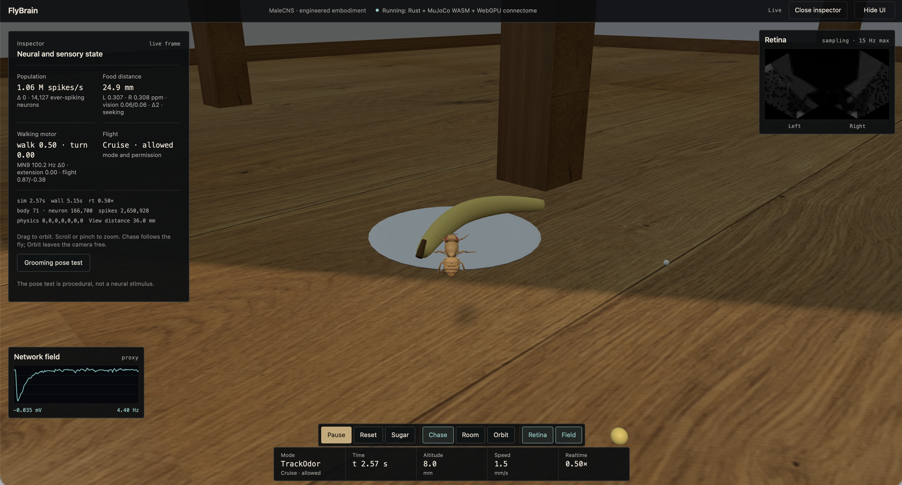

# FlyBrain Engine

[Run the live simulation at flybrain.mehran.dk](https://flybrain.mehran.dk/)

[](https://flybrain.mehran.dk/)

FlyBrain Engine is a native Rust + Metal implementation of the published leaky
integrate-and-fire model built from the FlyWire adult fruit-fly brain connectome. The production
runtime is Rust; Python remains as an independent Brian2/NumPy/MLX verification lane and as the
offline Parquet-to-CSR compiler.

The neural engine remains a separate, testable component, but the repository now also contains a
native Rust embodiment layer: MuJoCo runs an exported NeuroMechFly body, a fixed-rate bridge streams
sensory events into Metal, and a native GLFW viewer displays the ongoing 3D world. The offscreen
renderer remains available for repeatable experiment recordings.

The original foundation was [Shiu et al.'s FlyWire/Brian2 model](https://github.com/philshiu/Drosophila_brain_model),
first v630 and then v783, with FlyGym/NeuroMechFly for the body and senses and later
FlyBody flight components. MaleCNS is a subsequent, separate-specimen integration.
See [sources and scientific references](REFERENCES.md) and
[third-party licenses and attribution](THIRD_PARTY_NOTICES.md).

## Current result

### MaleCNS world integration — experimental

The MaleCNS v1.0 model now connects to the live world: 166,700 neurons and 24,469,412 signed
directed edges, including the nerve cord. A hash-bound I/O artifact selects annotated
olfactory, taste, visual-projection and haltere populations, and reads actual DLM/DVM wing-power,
wing-steering and leg motor-neuron activity. No cross-specimen wiring or synthetic edges are added.

This remains an engineered embodiment, not a recovered biological fly. Sensory rate conversion,
motion/loom proxies, motor-rate decoding, gait/wing waveforms and body stabilization are explicit
interfaces. The live HUD distinguishes motor activity from those proxies. A headless paired
check disconnects the motor readout while leaving all neurons running; a separate no-sensory-input
control checks that motion is not generated by a hidden flight schedule.
See [world integration and measured results](docs/cns-embodiment.md) and
[the verification command](docs/cns-world-verification.md).

Food approach now uses an explicitly engineered decoder of 127 matched DM1/DM2 ORNs
from the running CNS. It receives no food coordinates. Actual motor-neuron activity
gates locomotion, landing requires integrated DN/tibial activity, and physical taste
plus MN9 activity gates feeding. The calibration and its disconnection controls are
documented in [CNS odor guidance](docs/cns-odor-guidance.md); this is not a recovered
central food-search circuit.

The default-start 20-second engineering check finds fruit, feeds upright for 2.976
contiguous seconds with all six feet supported, then departs and reaches 189.874 mm
altitude. Matched odor-evoked-input and motor-output disconnection controls pass.
A second initial heading (+15°) also sustains 2.988 seconds of supported feeding and
departs. These are two starts, not evidence of general or biological foraging accuracy;
the changed-heading run's mesh-contact solver warnings are recorded in the report.

The earlier MeVP24–DNp10 landing hypothesis and strict 100 ms CPU-f64/Metal final-state gates
remain failed, with their reports preserved. Numerical investigation identifies deterministic
float32/FMA threshold timing, not a delay-ring or synchronization defect. World integration does
not turn those negative results into biological validation.
See [the pathway assay](docs/male-cns-pathway.md).

### v630 neural-engine benchmark

The native engine runs all 127,400 v630 model neurons and 14.7 million directed neuron-pair edges in
approximately **0.375–0.383 seconds per biological second** on the development M3 Max. That is about
**2.6× real time**, excluding pack loading and one-time Metal shader compilation. It uses 94,238,272
bytes of explicitly allocated Metal buffers.

The same one-second stimulus replayed through native Rust/Metal and the independent MLX/Metal engine
produces an identical 127,400-element per-neuron spike-count SHA-256. Their final states differ by at
most `0.000305176 mV` in voltage and `0.0000305176 mV` in conductance.

### FAFB v783 baseline embodied simulation

The FAFB baseline (`view --pack outputs/packs/flywire_v783`) advances all 138,639 modeled v783 neurons at the shared `0.1 ms`
brain/physics timestep and uses the complete graph of 15,091,983 directed neuron-pair edges. The
pinned neural-I/O artifact has 46 groups and 13,656 selected FlyWire IDs; 13,115 are present in the
v783 model pack and 541 are reported as missing rather than fabricated. The HUD distinguishes
simulated neurons from neurons that have actually spiked.

A deterministic ten-biological-second integration gate now starts on the floor, processes the full
v783 network, and permits takeoff only after sustained activity in the annotated flight descending
neurons. In the current pinned no-sugar test the first flight began at 0.226 seconds, reached 137.85
mm, selected cruise targets spanning 89.98–139.14 mm as decoded neural flight drive increased, and
completed the run without a false landing or fixed ground-search cycle. Exact annotated DNg02 and
DNg07 populations remain a separate signed, bounded altitude-target decoder. A brief candidate
command starts a two-second VNC motor-intent bout instead of being erased by the 50 ms rate filter.
This is not a claim of recovered flight biology: the wing waveform and ellipsoid
aerodynamics are published assets, while attitude, velocity, altitude integration, and boundary
control are visible engineering surrogates for the absent VNC, peripheral nervous system, muscles,
and body state.

“Full brain” in this repository means that every neuron represented by the v783 model pack is
numerically advanced; it does not mean that every neuron fires, or that the missing nervous-system
components and donor state have been reconstructed.

## Project layout

```text
Cargo.toml                  Rust package and native CLIs
rust/src/                   neural engine, embodiment bridge, MuJoCo world, renderer
rust/shaders/flybrain.metal Metal compute kernels
assets/neuromechfly/        hashed FlyGym body, MJCF, gait, and upstream license
fixtures/                   Brian-validated cross-language golden fixture
src/flybrain/               Python compiler and independent reference backends
tests/                      Python/Brian2/MLX tests
tools/                      exporters and independent neural/world verification
vendor/mujoco-rs/           pinned binding plus a documented macOS GLFW patch
outputs/packs/              compiled v630 and v783 CSR packs
outputs/runs/               hashed simulation results
outputs/world/              rendered videos, previews, and run manifests
```

The Rust runtime uses the maintained `objc2-metal` bindings, not the deprecated `metal-rs` crate.
The MSL source is embedded in the binary and compiled by Metal when an engine is created.

## Data port

| Pack | Model neurons | Directed neuron-pair edges | Anatomical contacts | Packed arrays |
|---|---:|---:|---:|---:|
| FlyWire v630, used by the paper | 127,400 | 14,687,178 | 52,793,639 | 89,651,872 bytes |
| FlyWire v783 | 138,639 | 15,091,983 | 54,492,922 | 92,215,570 bytes |

“Edges” are aggregated presynaptic/postsynaptic pairs. “Anatomical contacts” is the sum of their
absolute signed counts and is the quantity behind the commonly quoted roughly 50 million synapses.
The v783 simulator file contains 138,639 modeled neurons; it is not padded to the larger neuron count
reported for the broader annotated connectome.

Each runtime pack contains:

- `neuron_ids.npy`: FlyWire IDs in model-index order;
- `row_ptr.npy`: source-major CSR offsets;
- `destinations.npy`: postsynaptic model indices;
- `signed_counts.npy`: signed anatomical-contact counts;
- `manifest.json`: counts and source/array SHA-256 hashes.

Both compilers and loaders are intentionally strict. The Python compiler checks every ID/index
mapping, duplicate, bound, sign, count, and dtype range before writing atomically. The independent
Rust loader accepts only the compiler-owned NPY subset, recomputes all array hashes, and revalidates
the entire CSR graph and manifest counts.

## Native architecture

The runtime keeps CSR and neural state in shared Metal buffers. A chunked command scheduler encodes
many dependent ticks before committing, avoiding the per-tick host synchronization that dominated
the initial MLX implementation. Sensory input crosses the Rust/Metal boundary as sparse per-step
events. A delayed-spike kernel fuses decay/threshold work with CSR propagation, while the internal
ticks of each control window fuse the preceding reset/store phase with the next decay/threshold
phase. This removes a full-neuron dispatch per internal tick without changing Brian ordering at tick
boundaries. Kernel dispatch widths are cached from the compiled pipelines. The Brian fixtures retain
exact spike events and float32 state parity after these changes.

The live hot path is synchronous Rust and Metal: it has no Python process, Tokio runtime, application
mutex, or task queue. `parking_lot` is only a transitive dependency of the optional egui viewer. The
remaining embodied cost is measured work: MuJoCo advances at 10 kHz and the causal 500 Hz
brain/body loop commits and completes one Metal command buffer per 2 ms control window.
On the development M3 Max, the current ten-biological-second v783 flight gate spends 1.64 seconds
encoding sensory events, 23.05 seconds in Metal execution and synchronization, 24.70 seconds in the
complete brain bridge, and 31.08 seconds end to end. A matched 250 Hz coupling experiment improved
end-to-end time by only about 3%, so the default remains at the more responsive 500 Hz.

Each tick preserves Brian2 ordering:

1. exact closed-form linear update of `v` and `g` for non-refractory neurons;
2. strict threshold evaluation with `v > -45 mV`;
3. propagation of spikes delayed by `1.8 ms` through source-major CSR;
4. application of signed synaptic counts and direct external input;
5. reset and refractory update, followed by delay-ring storage.

Synaptic arrivals accumulate as deterministic `int32` contact counts. The global `0.275 mV` factor
is applied afterward, avoiding nondeterministic floating-point atomics. Incoming conductance can
accumulate while a neuron is refractory, matching the upstream Brian2 equations.

The published defaults are `dt=0.1 ms`, resting/reset voltage `-52 mV`, membrane time constant
`20 ms`, synaptic time constant `5 ms`, refractory period `2.2 ms`, and direct input weight
`68.75 mV`.

## Build the neural engine and world

The native runtime requires macOS, Apple silicon, Rust, Metal, and MuJoCo 3.9. The body assets are
already exported and hashed. Bootstrap the pinned FlyGym runtime that supplies the MuJoCo and GLFW
dynamic libraries:

```bash
git clone --branch v2.1.0 --depth 1 https://github.com/NeLy-EPFL/flygym.git \
  work/upstream/flygym
uv sync --project work/upstream/flygym --no-dev
python3 tools/setup_mujoco_runtime.py
cargo build --release --locked --bins
```

Python is optional for running the native binary, but required for data compilation and independent
verification:

```bash
uv sync --all-extras
```

The published source files can be obtained from the upstream model repository:

```bash
git clone --depth 1 https://github.com/philshiu/Drosophila_brain_model.git \
  work/upstream/Drosophila_brain_model
```

Regenerating the NeuroMechFly MJCF, simplified meshes, contact sensors, cameras, food marker, and
360-sample measured gait is explicit and refuses to replace the asset directory without `--force`:

```bash
MPLCONFIGDIR=work/matplotlib-cache \
  work/upstream/flygym/.venv/bin/python tools/export_flygym_world.py --force
```

The generated manifest records FlyGym tag `v2.1.0`, commit
`ca65a510c2afe6ac61c51df4f274c8d190c2f95f`, Apache-2.0 licensing, dimensions, mappings, and every
file hash. The vendored `mujoco-rs` change is documented in `vendor/mujoco-rs/FLYBRAIN_PATCH.md`; it
uses an invisible GLFW context on macOS, matching official MuJoCo Python, because the upstream
glutin fallback is rejected on this machine.

The browser port runs the same Rust world and MuJoCo model locally through
Emscripten, with WebGPU as the neural backend. Its pinned inputs, local build
commands, QA scope, and current limitations are documented in
[the browser runtime guide](docs/browser.md).

Native and browser appearance changes, regeneration, and visual/physics boundaries
are documented in [the appearance guide](docs/appearance.md).

## Compile and audit a pack

```bash
.venv/bin/flybrain pack \
  --completeness work/upstream/Drosophila_brain_model/2023_03_23_completeness_630_final.csv \
  --connectivity work/upstream/Drosophila_brain_model/2023_03_23_connectivity_630_final.parquet \
  --output outputs/packs/flywire_v630 \
  --materialization 630

target/release/flybrain-rs audit --pack outputs/packs/flywire_v630
```

Use `Completeness_783.csv` and `Connectivity_783.parquet` for v783.

## Verification

Run the native lint and test gates:

```bash
cargo fmt --package flybrain-engine -- --check
cargo clippy --all-targets --locked -- -D warnings
cargo test --all-targets --locked

# Requires the local v783 pack, MuJoCo, and an accessible Apple Metal device.
cargo test --release --test full_brain_world --locked -- --ignored --nocapture
```

The committed 15-tick fixture was generated by the NumPy float64 oracle and checked directly
against Brian2 2.5.1. Native Rust float64 matches it within `1.78e-15 mV`; Rust/Metal has exact spike
events and stays within `3.91e-6 mV`:

```bash
target/release/flybrain-rs verify-fixture \
  --fixture fixtures/tiny-parity-v1.json
```

Run a full-pack Rust float64 versus Rust/Metal check:

```bash
target/release/flybrain-rs verify-engine \
  --pack outputs/packs/flywire_v630 \
  --steps 1000 \
  --rate-hz 150 \
  --seed 20260816 \
  --chunk-steps 256
```

For the strongest independent accelerator check, replay the same counter-based events through native
Rust/Metal and the pre-existing MLX/Metal engine and compare every neuron's count plus final state:

```bash
.venv/bin/python tools/verify_native.py \
  --pack outputs/packs/flywire_v630 \
  --steps 10000 \
  --rate-hz 150 \
  --seed 20260816 \
  --chunk-steps 1000
```

Final results on the verification machine:

| Gate | Result |
|---|---|
| Rust unit tests | 173 passed, 0 failed; plus binary, physical grooming, and world integration gates |
| Full v783 brain/world integration | 3 passed, 0 failed; Metal-backed multisensory, foraging, and 10 s flight gates |
| Python/Brian2/MLX tests | 40 passed, 0 failed |
| Paper-version Brian2 2.5.1 tests | 5 passed, 0 failed |
| Rust/Metal vs Brian fixture | exact spike events; max `v` error `3.91e-6 mV` |
| v630, 100 ms Rust float64 vs Metal | all per-neuron counts exact; max `v` error `0.00067848 mV` |
| v783, 100 ms Rust float64 vs Metal | all per-neuron counts exact; max `v` error `0.000530581 mV` |
| v630, 1 s native Metal vs MLX Metal | all per-neuron counts exact; max `v` error `0.000305176 mV` |
| v630 native runtime | `0.375–0.383 s` per biological second with 1,000-tick chunks |
| Rust vs Python MuJoCo, 1,000 steps | exact time, qpos, qvel, contacts, and hashes |
| Sugar sensorimotor gate | MN9 response latency 32 ms; 291 spikes; rostrum command engaged |
| Full-v783 physical foraging | physical taste by 1 s; MN9 firing by 2 s; bounded post-meal release reached neural takeoff |
| Historical v2 feeding render | 3 s biology, 90 frames at 960×720, 5.67 s wall time |
| Full v783 autonomous flight | neural takeoff at 0.226 s; 89.98–139.14 mm targets; 137.85 mm peak altitude; no false landing or fixed ground-search cycle |

Float64 and float32 recurrent threshold trajectories are not expected to remain bit-identical
forever. With the one-second counter stimulus, the float64 oracle eventually takes different
threshold branches. This is reported rather than hidden. The relevant implementation check is that
two independently hosted float32 Metal engines agree exactly on every neuron's spike count and stay
numerically close in final state, while small deterministic fixtures lock tick ordering exactly.

## Run and save a native experiment

```bash
target/release/flybrain-rs simulate \
  --pack outputs/packs/flywire_v630 \
  --steps 10000 \
  --rate-hz 150 \
  --seed 20260816 \
  --chunk-steps 1000 \
  --output outputs/runs/my-native-run
```

The command refuses to replace an existing directory. Its output contains model-order FlyWire IDs,
per-neuron spike counts, firing rates, final voltage/conductance state, and a manifest recording all
parameters, timings, source hashes, and output hashes. The counter-based generator is deterministic
across Rust and Python; it has the same Bernoulli statistics as the upstream `N=1` input but does not
claim to reproduce Brian2's private RNG stream.

## Watch the embodied world live

To watch the simulation continuously in a native window, run:

```bash
target/release/flybrain-world view
```

The live command has no duration limit and does not create a video. Use
`--pack outputs/packs/male_cns_v1 --start-food-distance 40` to reproduce the CNS roaming setup,
or `--pack outputs/packs/flywire_v783` for the older brain-only baseline. Runtime controls are:

- `Space`: pause or resume;
- `R`: reset the body, brain, gait phase, and simulation clock;
- `T`: drop the movable sugar target onto the support surface below the fly;
- `F`: enable or disable the food stimulus;
- `G`: permit or inhibit brain-triggered autonomous flight;
- `H`: request a manual engineered grooming pose test, not neural stimulation;
- `W/A/S/D`: move the food target over the arena;
- `V`: show or hide the equal-size left and right ommatidial retina panels;
- `B`: show or hide the rolling EEG-like whole-network field proxy;
- `1`: wide chase camera centered on `fly/c_thorax`; `2` and `3`: external left and right side views;
  `4`: free camera; `5`: room camera; `6`: close tracking camera;
- in free-camera mode, drag with the left, right, or middle mouse button to orbit, pan, or zoom;
- `Escape`: close the viewer.

The live viewer defaults to the wide chase camera so translation through the room remains visible.
Pass `--camera chase` explicitly, or use any named MuJoCo camera such as `fly/trackingcam` or
`room_camera`. The offscreen `render` command keeps its close `fly/trackingcam` default.
The chase and side cameras select an unobstructed tracking azimuth and temporarily shorten their
distance near a room boundary, then restore the requested view after the fly clears the wall.

The overlay reports the measured realtime factor, body pitch, horizontal speed, signed headward
speed, food distance, taste state, MN9 rate, proboscis extension, foot contacts, and body position.
A compact `DN` line exposes left/right walking and flight rates plus their decoded drive; the
altitude line exposes DNg02/DNg07 rates and the landing-DN rate/drive, so a mode transition can be
traced to its neural command instead of inferred from the animation.
A positive headward speed means the body is moving toward its head rather than sliding tail-first.
The brain plot is a 100 Hz, 1–30 Hz band-passed trace of the actual Metal engine's whole-network mean
membrane-potential deviation, with a rolling 10-second window and a periodically estimated dominant
frequency. It is an EEG-like network-field proxy, not literal extracellular EEG: the public data do
not contain the morphologies, tissue conductivities, or electrode geometry needed to reconstruct
one. Disabling the plot disables its whole-state readback. A pinned full-v783 taste-pathway test
maintains physical sugar contact at the proboscis: sugar GRNs stimulate the full Metal connectome,
MN9 fires, and the articulated proboscis extends. It does not claim that an odorless crystal can be
located at a distance. `T` places sugar on a real support surface so an airborne fly must approach
and land before it can taste it. Walking retains the
measured FlyGym joint trajectory as an explicit muscle/body surrogate. In the FAFB mode,
bilateral walking-DN activity controls gait drive and steering. MaleCNS instead reads leg
motor neurons for cadence and uses the labeled ORN guidance interface during food search.
The trajectory generator and bounded post-meal departure remain engineered.

Continuous food contact no longer latches the fly in place forever. The engineered embodiment holds
a three-second meal while taste continues to drive the sugar-GRN-to-MN9 pathway, then enters a
`POST-MEAL` state that adapts taste input, lets the proboscis command decay, and performs a bounded
1.25-second departure whose turn decays toward a straight path. The departure then releases the
decoded neural takeoff command and ignores the just-visited plume for landing arbitration until the
fly is airborne or has left it. A twelve-second refractory interval prevents immediate re-feeding
without suppressing flight. This bounded meal and taste-adaptation state is an explicit
internal-state approximation, not a recovered satiety circuit. Grounded obstacle avoidance also
reduces gait drive as forward clearance closes, rather than charging into furniture while turning.

Odor navigation does not receive resource coordinates. The habitat samples a continuous,
finite-core advection–diffusion field at both antennae and drives annotated olfactory
populations. In MaleCNS, a ratio-based ORN decoder supplies heading and close-odor context;
a 250 ms leaky integrator of landing-DN/tibial activation supplies landing intent. Close
odor alone cannot command descent. The older FAFB interface uses descending-neuron
steering and its existing landing gate. These decoders are engineering interfaces, not
validated biological policies.

Landing brakes and levels the body, transfers wing support to the legs, then synchronizes
gait startup with adhesion. Food/perch contact physics matches the calibrated floor;
wall-contact settings are preserved separately. An active MN9 feeding command holds the
leg targets and gait phase together. Taste does not erase odor context, so momentary
contact loss does not immediately release takeoff. Final feeding still requires physical
mouth proximity and MN9 spikes; neither odor nor a resource ID can assert taste.

### Calibrated olfaction

The habitat odor field is expressed in **isobutylene-equivalent ppm**, using apple-cider vinegar as the
reference stimulus. This is a sensor calibration unit, not a claim that the fly detects isobutylene or
that a liquid dilution maps directly to gas-phase ppm. Vapor pressure, temperature, carrier flow, and
source geometry must be measured before interpreting the values as an environmental concentration
([Zhou & Wilson 2012](https://pmc.ncbi.nlm.nih.gov/articles/PMC3544999/)).

Each antenna is transduced independently. The current food-odor model uses an 8 Hz spontaneous-rate
floor and a 200 Hz evoked-rate ceiling, a Hill response with exponent `1.42`, fast gain adaptation of
`0.25 s`, response rise/fall constants of `0.04/0.20 s`, and a slower behavioral adaptation constant of
`9.8 s`. The Hill form follows complete ORN dose-response measurements ([Si et al. 2019](https://pmc.ncbi.nlm.nih.gov/articles/PMC6756926/));
gain control and slow behavioral adaptation are supported by [Gorur-Shandilya et al. 2017](https://elifesciences.org/articles/27670)
and [Álvarez-Salvado et al. 2018](https://elifesciences.org/articles/37815). The neural-I/O artifact keeps
this mapping sparse: bilateral selected ORN populations are assigned to eight antennal-lobe glomeruli
(`DM1–DM5`, `DP1m`, `VA2`, `VM2`) and four response bands, rather than fabricating a complete receptor
transducer. The recruitment bands are anchored to measured vinegar responses at 3, 12, and 32 ppm
([Semmelhack & Wang 2009](https://pmc.ncbi.nlm.nih.gov/articles/PMC2702439/)).

Pure sucrose is treated as odorless at a distance: `sugar_drop` has zero odor-source ppm and is found
through visual/context cues and physical taste contact. Fermenting, flavored, or contaminated sugar can
be given volatile components separately. The connectome does not supply a validated peripheral receptor
calibration, complete maxillary-palp input, odor-mixture chemistry, or a FlyWire-to-body/VNC mapping, so
the olfactory rates and sparse glomerular routes remain explicit, testable engineering approximations.

Front-leg grooming remains an engineered pose diagnostic, not a neural behavior. Automatic
idle-timer grooming is disabled whenever a brain is connected. World-only diagnostics retain the
legacy fallback, and `H` manually requests the same pose test. Taste, feeding, and flight suppress
or abort it, with at least four supporting legs required. Head and antenna joints exist, but the
bridge lacks a validated grooming sensory pathway and neural-to-actuator mapping. DNg12/aDN
candidates are present in the exact MaleCNS pack; candidate presence alone does not validate
grooming behavior. See [the neural grooming boundary](docs/neural-grooming.md).

The two eye insets reproduce FlyGym v2.1.0's compound-retina display independently: each `450 × 512`,
`157°` eye-camera render is corrected with FlyGym's calibrated fisheye map, averaged into 721
ommatidia using the pinned yellow/pale receptor mask, and expanded back onto FlyGym's hexagonal
lattice without changing its portrait aspect ratio. The panels are equal size and shown side by side.
Each panel is uploaded and blitted independently; this avoids the macOS compositor path that dropped
the right half of a single wide binocular upload.
Their mirrored camera origins sit at the modeled compound eyes, and the fly's own render geometry is
removed from both eye scenes so a camera cannot look through the body. The Rust transform is checked
against an exact FlyGym-generated reference fixture. The visible hexagons show sampling geometry;
they are not a claim that the animal perceives literal hexagonal borders. The grayscale HUD is a
human-readable view of those receptor samples, not a claim that a fly experiences grayscale imagery.
In live mode, the measured mean intensity from each eye drives the present left/right photoreceptor populations.
This is still a coarse per-eye broadcast, not a validated ommatidium-to-FlyWire retinotopic mapping;
the 721 samples are not yet routed one ommatidium at a time into the connectome.

Takeoff is not timer-triggered. A filtered decoder of the annotated flight DNs must exceed its
threshold for 150 ms. The resulting drive and bilateral steering command the published wingbeat
generator through an explicit low-level flight surrogate. The surrogate is bounded to ±60
`g·mm²/s²` attitude torque, 0.4 body-weight horizontal correction, and 0.8 body-weight vertical
correction. Its body-pitch reference is FlyBody's pinned 47.5° flight pose, and its 300 mm/s cruise
target is the midpoint of FlyBody's pinned 20–40 cm/s vision-flight task range. Furniture rays run at
100 Hz. An overhang selects and holds a world-space lateral exit instead of repeatedly issuing the
same body-relative turn; if that path remains blocked it is replanned, and an airborne fly also
receives a bounded 14 mm descent target. Room walls are physical contact surfaces rather than
invisible repulsion zones, so the fly can approach them. Multi-tarsus wall contact accompanied by a
landing-DN command can complete a stable-contact landing and engage the adhesion actuators. Incidental
contact during full-brain cruise cannot silently switch the controller to grounded; neural flight
drive can initiate takeoff.
A perched takeoff or airborne wall strike releases adhesion, brakes, and uses a yaw-invariant
attitude target to turn toward the room before accelerating. The reflex remains in control until the
fly has at least 20 mm of clearance, no tarsal wall support, and sustained head-first inward motion;
a bounded departure handoff prevents residual velocity from carrying the tail-first fly back into
the same wall. Corner contacts combine the two inward normals so the fly clears both walls. These are engineered
body/VNC behaviors, not recovered wall-landing connectomes. Transparent physical front and ceiling
surfaces close the room without blocking the outside room camera. Takeoff still targets 18 mm;
landing targets 1.4 mm above the measured support below the fly, so floor, table, shelf, and resource
touchdowns no longer share an incorrect absolute height. On entry to cruise the neutral target starts
at 28 mm. During full-brain flight, the peak decoded flight-DN population drive selects a bounded
higher setpoint inside the habitat's explicit 5–208 mm flight envelope; this converts neural flight
power into altitude without procedural altitude wandering. A signed DNg02-versus-DNg07 decoder can
add a bounded motor-intent bout that moves the retained target at up to 40 mm/s.
[Namiki et al. (2022)](https://doi.org/10.1016/j.cub.2022.01.008) provide causal evidence that
DNg02 activation increases wingbeat amplitude and available flight power. The negative DNg07 arm
is only a candidate: the published reduced-amplitude screen used a driver that also contained
DNg08/DNg09. Turning their rate difference into metric climb/descent is therefore an engineered
hypothesis, not an identified altitude connectome. A direct v783 sensory sweep found no DNg02 spikes
from the currently available visual, olfactory, taste, MsAHN/MtAHN, or JO-E channels. The HUD reports
that zero rather than pretending the specific altitude candidate fired; the higher setpoint is
explicitly attributed to the broader decoded flight-DN population.

A reverse scan of the packed v783 graph explains that result. The currently driven MsAHN/MtAHN
groups contribute only a handful of direct edges into these populations. DNg07 instead receives
strong direct input from annotated Johnston's-organ groups, especially JO-EDM and JO-E, while DNg02's
strongest inputs are predominantly intrinsic central populations. A direct intervention showed that
the former absolute-motion JO-E proxy drove DNg07 and landing neurons but never DNg02, producing the
erroneous low-altitude/landing loop, so that proxy is now disabled. The JO-E groups remain pinned for
a future directional, experimentally validated mechanosensory transducer.

Use `--speed 0.5` for slow motion, `--no-brain` to inspect body physics without the connectome, or
`--help` to see all viewer options. `--max-seconds` exists for automated smoke tests; omit it for an
ongoing session. Full-brain live playback is not guaranteed to reach 1.0x realtime yet. `B` and `V`
control the graph and eye inset. `B` disables whole-population graph readback; `V` only hides the
inset while retinal capture continues to drive the brain. `--speed` is a requested playback rate and
cannot exceed the measured compute rate shown in the title and HUD.

## Record the embodied world

Inspect the body/gait contract, render the brain-enabled default world, and independently replay a
neutral MuJoCo trace through Python:

```bash
target/release/flybrain-world inspect

target/release/flybrain-world render \
  --pack outputs/packs/flywire_v783 \
  --duration-seconds 3 \
  --fps 30 \
  --width 960 \
  --height 720 \
  --output outputs/world/flybrain-world-mn9-v2.mp4 \
  --force

MPLCONFIGDIR=work/matplotlib-cache \
  work/upstream/flygym/.venv/bin/python tools/verify_world.py \
  --steps 1000 \
  --output outputs/world/world-parity-v2.json

.venv/bin/python tools/verify_sensorimotor.py \
  --manifest outputs/world/flybrain-world-mn9-v2.json \
  --output outputs/world/sensorimotor-verification-v2.json
```

The world has 133 generalized positions, 132 velocities, 127 joints, 42 leg position actuators, six
adhesion actuators, two coordinated proboscis pitch actuators, and six ground-contact sensors. Rust
interpolates FlyGym's recorded seven-joint single-leg trajectories into a tripod gait; no Python process
participates at runtime. Physics and brain both use `0.1 ms`; sensory/motor exchange occurs in
causal 20-step windows at 500 Hz.

At full extension the bounded command targets approximately `-0.9 rad` at the head-to-rostrum joint
and `+0.65 rad` at the rostrum-to-haustellum joint, while the neutral keyframe leaves both at rest.

The current bridge is partial and named as such in every render manifest:

- mouth-to-food distance inside `0.75` model units becomes a deterministic 0–150 Hz taste drive to
  the published right sugar GRNs;
- contralateral MN9 spikes drive a bounded leaky command over the existing rostrum and haustellum
  pitch joints; the paper validates the sugar-to-MN9 pathway, while this coordination is an explicit
  embodiment mapping;
- feeding suppresses gait phase so the low-level FlyGym gait does not carry the fly through its
  food; this arbitration remains an explicit embodiment assumption;
- bilateral food-odor response bands drive 401 pinned ORNs; the other 1,689 annotated ORNs retain
  only the 8 Hz spontaneous baseline until an odor-identity response profile is available. Per-eye
  mean retinal intensity drives the annotated photoreceptor populations;
- annotated walking and flight DNs are decoded into bounded steering/drive signals; with the brain
  enabled, common walking-DN activity controls gait magnitude, normal procedural walking/flight turn
  terms and raw-odor landing are disabled, and four ascending haltere neurons receive an angular-speed
  proxy;
- all 25 v783-annotated DNg02 roots and all 16 DNg07 roots are separately probed; their filtered
  bilateral rates drive the candidate climb/descent integrator, and are deliberately excluded from
  the generic takeoff/steering average so a silent candidate population cannot dilute flight drive;
- the measured gait and adhesion controller remain the low-level walking VNC surrogate; physical
  multi-tarsus wall contact plus landing-DN activity may engage adhesion and hold a wall perch;
- the published FlyBody waveform drives the wing joints, while bounded attitude, planar velocity,
  altitude-target tracking, and collision-clearance controllers remain the low-level flight VNC/body
  surrogate.

The offscreen recorder currently does not render the two eye cameras into neural input, so its
retinal summaries remain zero. The live viewer does render and process both calibrated eye cameras
and is the correct mode for camera-driven visual experiments.

These are explicit engineering assumptions. The connectome does not provide a validated sensory
transducer, brain-to-VNC mapping, or muscle controller, and the public brain dataset does not include
the donor's full body/VNC state.

## Apple Neural Engine boundary

This runtime uses the Apple GPU through Metal. MLX does not target the separate Apple Neural Engine,
and the connectome's irregular sparse event propagation is a poor Core ML/ANE workload. A later
FlyGym system may reasonably evaluate ANE for dense visual encoders or learned motor policies, while
the recurrent connectome remains on Metal.

## Scope

This milestone verifies the published point-neuron/connectome dynamics and provides a reproducible
engineering embodiment around it. All modeled v783 neurons run continuously, but the model still
uses identical LIF units, zero basal activity, fixed weights, and no plasticity, gap junctions,
neuromodulators, hormones, individual memories, or measured donor state. The sugar-to-MN9 readout is
published; sensory transducers, spike-to-body transfer functions, walking gait, flight stabilization,
and arbitration remain engineering models. It does not recover the VNC/muscle system, reproduce
Eon's unpublished bridge, or preserve the scanned fly's identity. A closed loop is infrastructure
for experiments, not evidence that the donor fly was copied or revived.

## Licenses and attribution

Original FlyBrain code is [MIT licensed](LICENSE); the complete repository is not
a uniformly MIT-licensed bundle. FlyWire public v783 data/annotations use
CC BY-NC 4.0, MaleCNS v1.0 uses CC BY 4.0, FlyGym and FlyBody code use Apache-2.0,
and FlyBody's separately downloaded flight datasets/policies use GPL-3.0-or-later.
The earlier v630 data grant needs separate confirmation before redistribution.
See [the component inventory and distribution caveats](THIRD_PARTY_NOTICES.md),
[retained license texts](licenses/README.md), and [scientific references](REFERENCES.md).
